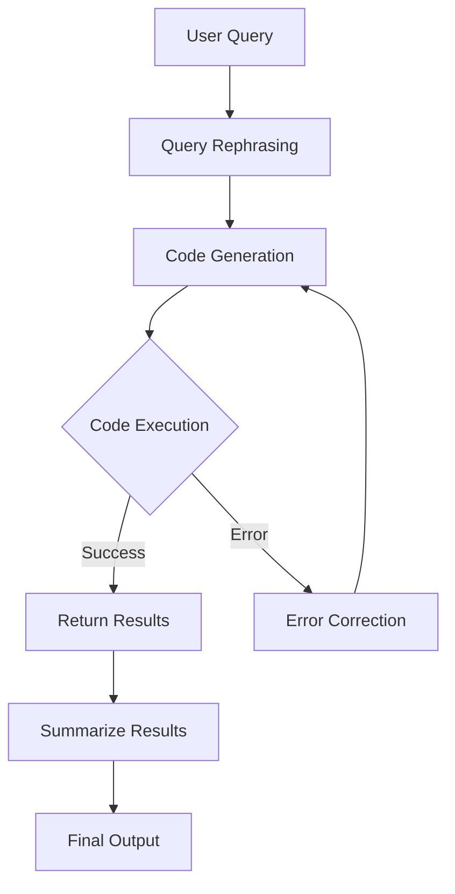

# StatFlowGPT🎓🪄

StatFlowGPT a conversational data analysis tool that leverages the power of Large Language Models (LLMs) to provide intuitive and efficient data analysis capabilities.

## Features

- Utilizes LLMs (OpenAI and TogetherAI APIs) in a multi-step pipeline for conversational data analysis
- Rephrases user queries into precise prompts for better code generation
- Generates and executes Python code to solve data analysis queries
- Automatic error correction using LLMs
- Supports graphical plots
- Uses streamlit interface 

## How It Works

StatFlowGPT employs a sophisticated multi-step pipeline to process user queries and generate accurate results:



1. **Query Rephrasing**: The user's raw query is rephrased into a more precise prompt, enabling better code generation.
2. **Code Generation**: An LLM generates Python code to solve the data analysis query.
3. **Code Execution**: The generated code is run locally.
4. **Error Correction**: If any errors occur during execution, another instance of the LLM is called to fix the errors.
5. **Results**: Once the code runs successfully, the answers are summarized and returned.

## Installation

```bash
git clone https://github.com/yourusername/StatFlowGPT.git
cd StatFlowGPT
pip install -r requirements.txt
```
## Configuration

To use StatFlowGPT, you need to set up your API keys for OpenAI and TogetherAI. Create a `.env` file in the project root and add your keys:

```
OPENAI_API_KEY=your_openai_api_key
TOGETHERAI_API_KEY=your_togetherai_api_key
```

## Contributing

We welcome contributions to StatFlowGPT! Please submit pull requests, report issues, and suggest improvements.

## License

This project is licensed under the MIT License - see the [LICENSE](LICENSE) file for details.